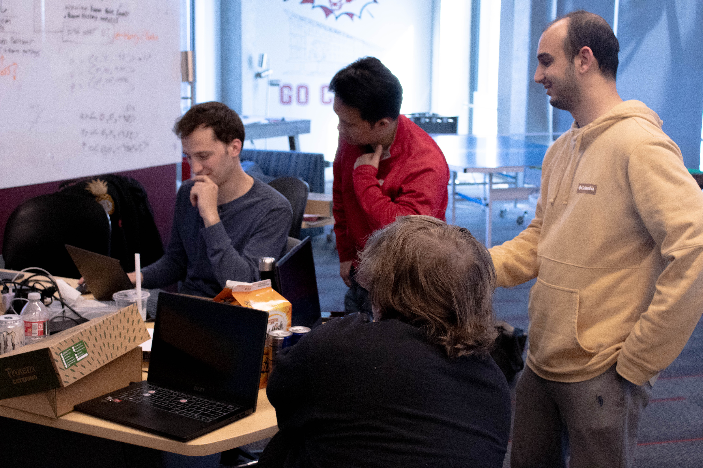
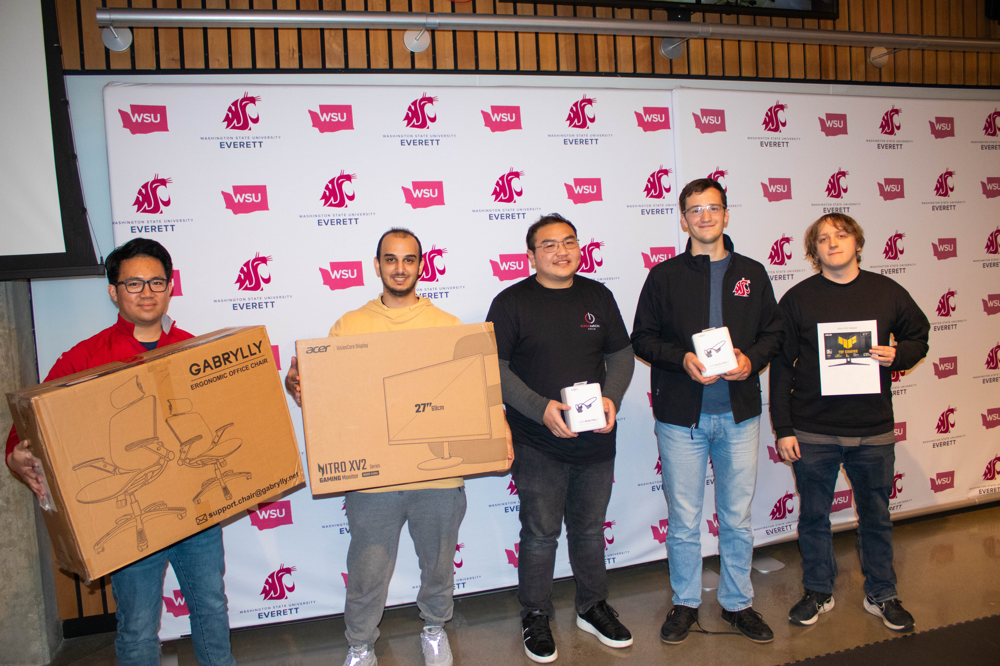

# Hackathon Reflection Report
**Event:** WSU Everett CougHacks 24-Hour Hackathon

---

## Activity Description

CougHacks was a 24-hour hackathon hosted at WSU Everett, where our team of 5 were expected to remain on-site for the full duration and deliver a working project to present at the end.

Our team built **CougPulse**, a campus monitoring platform with two distinct sides: a live student-facing noise heatmap that visualizes room activity levels across a floor plan, and a security operations console that supports facial recognition, device management, alerts, and layout planning. The full stack included Next.js 16, React 19, TypeScript, Prisma with PostgreSQL, Tailwind CSS 4, and face-api.js for facial recognition.

---

## Technical Decisions

The team adopted an AI-assisted development workflow as a core strategy. Rather than jumping straight into the final tech stack, we began with an HTML prototype of the user interface. This prototype gave everyone on the team a shared picture of what the application should look and behave like before any production code was written.

Once the prototype captured all intended use cases and was visually refined, it was provided to the AI as context to guide development of the actual application. This approach is effective because HTML is easy for AI models to read and understand, making it simpler for them to grasp the intended layout, structure, and user interactions. It also reduced back-and-forth clarification during code generation.

Security was also a deliberate consideration: passwords were hashed with Argon2id, sensitive fields were encrypted with AES-256-GCM, and login endpoints included throttling per user/IP to guard against abuse.

---

## Contributions

My primary individual contribution was designing and building the HTML prototype of the user-facing interface. This meant translating the team's ideas into a visual layout that covered all intended use cases, and refining it both functionally and visually until it was solid enough to hand off as a development reference.

Beyond the prototype, I assisted with manual integration testing to ensure the client devices, backend, and UI were communicating correctly end-to-end. I also contributed as a pair programmer during feature development and helped put together the final presentation slides.

---

## Quality Assessment

I think I did well overall and gave as much as I could throughout the event. I collaborated closely with my teammates and tried to learn from them along the way. If I could do it again, I would try to take more initiative and try to manage my energy / fatigue levels. Overall, I think I have done my best, and produced what I can.

---

# Proof of Participation

